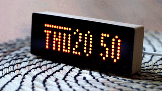
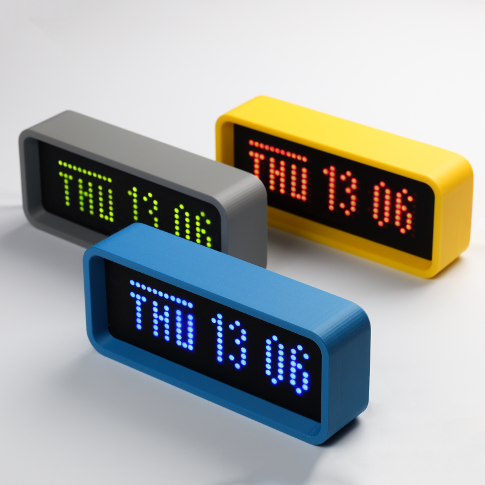
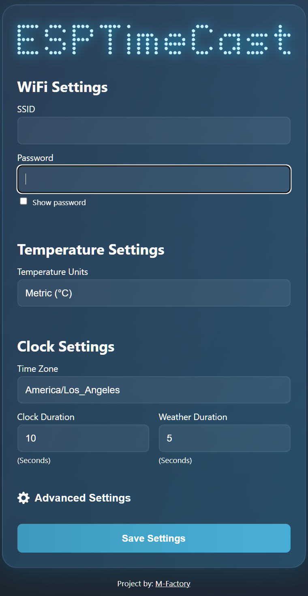

# ESPTimeCast
## Netatmo / Local Sensor 

Some notes:  While this is still a work-in-progress and lacks polish, it is at least functional as of 
29c2f39.  A lot of the code churn is because the tiny device struggles with the complexity of modern API calls and JSON payloads.  It can handle it, in theory, but experience has shown that careful memory management is necessary, and code which prioritizes memory conservation over anything else.

## Recent Changes

### OAuth2 Authentication for Netatmo

The authentication system has been completely redesigned to use OAuth2 instead of username/password. This provides better security and compatibility with Netatmo's API requirements.

### Watchdog Timer Fix

The proxy functionality has been moved to the main loop to avoid watchdog timeouts. This is accomplished by:
1. Setting up a deferred request system where the web server handler only stores the request parameters
2. Processing the actual HTTP requests in the main loop() function
3. Adding yield() calls at critical points to feed the watchdog timer

### Memory Optimization

Several memory optimizations have been implemented to prevent out-of-memory crashes:
1. Improved handling of "NoMemory" errors during configuration validation
2. Disabled file dumping in production to save memory
3. Used fixed-size buffers instead of String objects for response preview
4. Added memory optimization functions for BearSSL clients and HTTPClient instances
5. Added explicit memory cleanup after API calls

While the local temperature sensor works great, I'd recommend putting the probe outside the case where it can get clean readings.  Inside the case, the modest heat from the ESP8266 is enough to make temperature readings suspiciously high and probably pointless.

**ESPTimeCast** is a WiFi-connected LED matrix clock and temperature display based on ESP8266 and MAX7219.  
It displays the current time, day of the week (with custom symbols), indoor temperature from a DS18B20 sensor, and outdoor temperature from a Netatmo weather station.  
Setup and configuration are fully managed via a built-in web interface.  

 

Get the 3D printable case!

---

## ✨ Features

- **LED Matrix Display (8x32)** powered by MAX7219, with custom font support
- **Simple Web Interface** for all configuration (WiFi, Netatmo API, time zone, display durations, and more)
- **Automatic NTP Sync** with robust status feedback and retries
- **Day of Week Display** with custom icons/symbols
- **Indoor Temperature** from DS18B20 sensor
- **Outdoor Temperature** from Netatmo weather station
- **Temperature Unit Selector** (`C`, `F`, or `K` displays in temp mode only)
- **Fallback AP Mode** for easy first-time setup or WiFi recovery, with `/ap_status` endpoint
- **Timezone Selection** from IANA names (DST integrated on backend)
- **Persistent Config** stored in LittleFS, with backup/restore system
- **Status Animations** for WiFi conection, AP mode, time syncing.
- **Advanced Settings** panel with:
  - Custom **Primary/Secondary NTP server** input
  - Display **Day of the Week** toggle (defualt in on)
  - **24/12h clock mode** toggle (24-hour default)
  - Show **Indoor Temperature** toggle
  - Show **Outdoor Temperature** toggle
  - **Flip display** (180 degrees)
  - Adjustable display **brightness**
    
---

## 🪛 Wiring

**Wemos D1 Mini (ESP8266) → MAX7219**

| Wemos D1 Mini | MAX7219 |
|:-------------:|:-------:|
| GND           | GND     |
| D6            | CLK     |
| D7            | CS      |
| D8            | DIN     |
| 3V3           | VCC     |

**Wemos D1 Mini (ESP8266) → DS18B20**

| Wemos D1 Mini | DS18B20 |
|:-------------:|:-------:|
| GND           | GND     |
| D2            | DATA    |
| 3V3           | VCC     |

**Note:** Connect a 4.7kΩ pull-up resistor between DATA and VCC for the DS18B20.

---

## 🌐 Web UI & Configuration

The built-in web interface provides full configuration for:

- **WiFi settings** (SSID & Password)
- **Netatmo settings** (Client ID, Client Secret, OAuth2 authorization)
- **Time zone** (will auto-populate if TZ is found)
- **Display durations** for clock and temperature (milliseconds)
- **Advanced Settings** (see below)

### First-time Setup / AP Mode

1. Power on the device. If WiFi fails, it auto-starts in AP mode:
   - **SSID:** `ESPTimeCast`
   - **Password:** `12345678`
   - Open `http://192.168.4.1` in your browser.
2. Set your WiFi and all other options.
3. Click **Save Setting** – the device saves config, reboots, and connects.

### Netatmo Setup

1. After connecting to WiFi, navigate to `http://[device-ip]/netatmo.html`
2. Enter your Netatmo Client ID and Client Secret
3. Click "Authorize with Netatmo" to start the OAuth2 flow
4. After authorization, you can select your weather station and modules
5. Use the "Refresh Token" button if the token expires

### UI Example:

---

## ⚙️ Advanced Settings

Click the **cog icon** next to "Advanced Settings" in the web UI to reveal extra configuration options.  

**Available advanced settings:**

- **Primary NTP Server**: Override the default NTP server (e.g. `pool.ntp.org`)
- **Secondary NTP Server**: Fallback NTP server (e.g. `time.nist.gov`)
- **Day of the Week**: Display symbol for Day of the Week
- **24/12h Clock**: Switch between 24-hour and 12-hour time formats (24-hour default)
- **Indoor Temperature**: Display indoor temperature from DS18B20
- **Outdoor Temperature**: Display outdoor temperature from Netatmo
- **Flip Display**: Invert the display vertically/horizontally
- **Brightness**: 0 (dim) to 15 (bright)

*Note: Netatmo settings have been moved to the Advanced Settings section for a cleaner interface.*

*Tip: Changing these options takes effect after saving and rebooting.*

---

## 📝 Configuration Notes

- **Netatmo API Setup:**
  1. Create a Netatmo developer account at [https://dev.netatmo.com/](https://dev.netatmo.com/)
  2. Create a new app to get your Client ID and Client Secret
  3. Enter your Client ID and Client Secret in the ESPTimeCast web interface
  4. Click "Authorize with Netatmo" to start the OAuth2 flow
  5. Log in to your Netatmo account when prompted
  6. Grant the requested permissions (the required scopes are automatically requested)
  7. You'll be redirected back to ESPTimeCast with an authorization code
  8. ESPTimeCast will exchange this code for access and refresh tokens
  9. In your Netatmo developer app settings, add the redirect URI: `http://[device-ip]/api/netatmo/callback`
  10. If you see "request is blocked" errors:
      - Check your app permissions in the Netatmo developer portal
      - Try regenerating your client ID and secret
      - Make sure your Netatmo account has the proper permissions to access the weather station
  11. **Troubleshooting authentication issues**:
      - Visit `http://[device-ip]/netatmo.html` to manage Netatmo settings
      - Check the "Token Status" to verify if authentication is working
      - Use the "Refresh Token" button if the token has expired
      - Verify that your redirect URI is correctly configured in the Netatmo developer portal
- **Device ID and Module IDs:** 
  - After authenticating with Netatmo, ESPTimeCast will automatically fetch your devices
  - Select your weather station and modules from the dropdown menus
  - For outdoor temperature, select the outdoor module
  - For indoor temperature, you can optionally select the base station or another indoor module
- **Temperature Source Options:**
  - **Local sensor primary:** Uses the DS18B20 sensor for indoor temperature, falls back to Netatmo if local sensor fails
  - **Netatmo primary:** Uses Netatmo for indoor temperature, falls back to local sensor if Netatmo fails
- **Time Zone:** Select from IANA zones (e.g., `America/New_York`, handles DST automatically)
- **Units:** `metric` (°C), `imperial` (°F), or `standard` (K)

---

## 🔧 Installation

1. **Clone this repo**
2. **Flash the ESP8266** using Arduino IDE or PlatformIO
3. **Upload `/data` folder** with LittleFS uploader (see below)

### Board Setup

- Install ESP8266 board package:  
  `http://arduino.esp8266.com/stable/package_esp8266com_index.json`
- Select **Wemos D1 Mini** (or your ESP8266 variant) in Tools → Board

### Dependencies

Install these libraries (Library Manager / PlatformIO):

- `ArduinoJson` by Benoit Blanchon
- `MD_Parola / MD_MAX72xx` all dependencies by majicDesigns
- `ESPAsyncTCP` by ESP32Async
- `ESPAsyncWebServer` by ESP32Async
- `OneWire` by Paul Stoffregen
- `DallasTemperature` by Miles Burton
- `ESP8266HTTPClient` (included in ESP8266 core)
- `WiFiClientSecureBearSSL` (included in ESP8266 core)

### LittleFS Upload

Install the [LittleFS Uploader](https://randomnerdtutorials.com/arduino-ide-2-install-esp8266-littlefs/).

**To upload `/data`:**

1. Open Command Palette:
   - Windows: `Ctrl+Shift+P`
   - macOS: `Cmd+Shift+P`
2. Run: `Upload LittleFS to ESP8266`

**Important:** Serial Monitor **must be closed** before uploading!

---

## 📺 Display Behavior

**ESPTimeCast** automatically switches between two display modes: Clock and Temperature.  
What you see on the LED matrix depends on whether the device has successfully fetched the current time (via NTP) and temperatures (from DS18B20 and Netatmo).  
The following table summarizes what will appear on the display in each scenario:

| Display Mode | 🕒 NTP Time | 🌡️ Indoor Temp | 🌡️ Outdoor Temp | 📺 Display Output                              |
|:------------:|:----------:|:-------------:|:--------------:|:--------------------------------------------|
| **Clock**    | ✅ Yes      | —             | —              | 🗓️ Day Icon + ⏰ Time (e.g. `@ 14:53`)           |
| **Clock**    | ❌ No       | —             | —              |  `no ntp` (NTP sync failed)               |
| **Temp**     | —          | ✅ Yes        | ✅ Yes         | 🏠 Indoor + 🌍 Outdoor (e.g. `23º│18º`)      |
| **Temp**     | —          | ✅ Yes        | ❌ No          | 🏠 Indoor only (e.g. `i 23ºC`)              |
| **Temp**     | —          | ❌ No         | ✅ Yes         | 🌍 Outdoor only (e.g. `o 18ºC`)            |
| **Temp**     | ✅ Yes      | ❌ No         | ❌ No          | 🗓️ Day Icon + ⏰ Time (e.g. `@ 14:53`)           |
| **Temp**     | ❌ No       | ❌ No         | ❌ No          |  `no temp` (no temperature or time data)    |

### **How it works:**

- The display automatically alternates between **Clock** and **Temperature** modes (the duration for each is configurable).
- In **Clock** mode, if NTP time is available, you'll see the current time plus a unique day-of-week icon. If NTP is not available, you'll see `no ntp`.
- In **Temperature** mode, you'll see indoor and/or outdoor temperatures depending on what's available:
  - If both are available, it shows both temperatures separated by a short vertical line (e.g., "23º│18º")
  - If only indoor is available, it shows lowercase "i" followed by the temperature (e.g., "i 23ºC")
  - If only outdoor is available, it shows lowercase "o" followed by the temperature (e.g., "o 18ºC")
  - If neither is available but time is, it falls back to showing the clock
  - If no data is available, you'll see `no temp`
- All status/error messages (`no ntp`, `no temp`) are shown exactly as written.

**Legend:**
- 🗓️ **Day Icon**: Custom symbol for day of week (`@`, `=`, etc.)
- ⏰ **Time**: Current time (HH:MM)
- 🏠 **Indoor**: Temperature from DS18B20 sensor
- 🌍 **Outdoor**: Temperature from Netatmo weather station
- ✅ **Yes**: Data available
- ❌ **No**: Data not available
- — : Value does not affect this mode

---

## 🤝 Contributing

Pull requests are welcome! For major changes, please open an issue first to discuss.

---

## ☕ Support original author

If you like this project, you can [buy him a coffee](https://paypal.me/officialuphoto)!

---

## 🔄 Modifications

This is a modified version of the original ESPTimeCast project that replaces OpenWeatherMap with:
1. Indoor temperature from a DS18B20 temperature sensor
2. Outdoor temperature from Netatmo weather station

### Changes Made:

1. **Added Libraries**:
   - OneWire and DallasTemperature for DS18B20 sensor
   - ESP8266HTTPClient and WiFiClientSecureBearSSL for Netatmo API

2. **Configuration Changes**:
   - Removed OpenWeatherMap settings (API key, city, country)
   - Added Netatmo API settings (Client ID, Client Secret, Username, Password)
   - Added Netatmo device and module IDs
   - Changed showHumidity to showIndoorTemp and showOutdoorTemp

3. **Hardware Support**:
   - Added DS18B20 temperature sensor on GPIO4 (D2)
   - Kept existing MAX7219 LED Matrix configuration

4. **Display Logic**:
   - Modified to show indoor and outdoor temperatures
   - Added indicators to distinguish between indoor and outdoor readings
   - Maintained compatibility with existing time display

### Troubleshooting:

- If the device shows "no temp" for indoor temperature, check the DS18B20 wiring
- If the device shows "no temp" for outdoor temperature, verify your Netatmo credentials and IDs
- If the time is incorrect, make sure the time zone is properly configured

## Credits

Based on the original ESPTimeCast project by mfactory-osaka.
